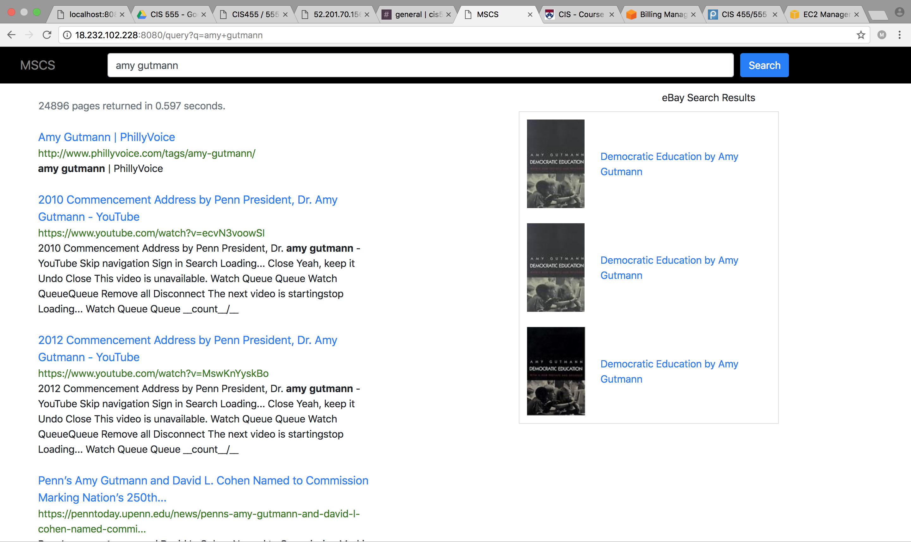
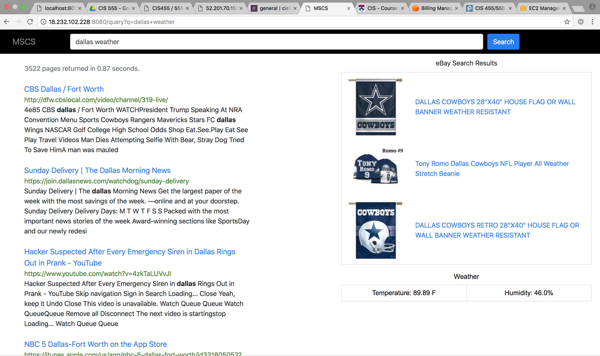
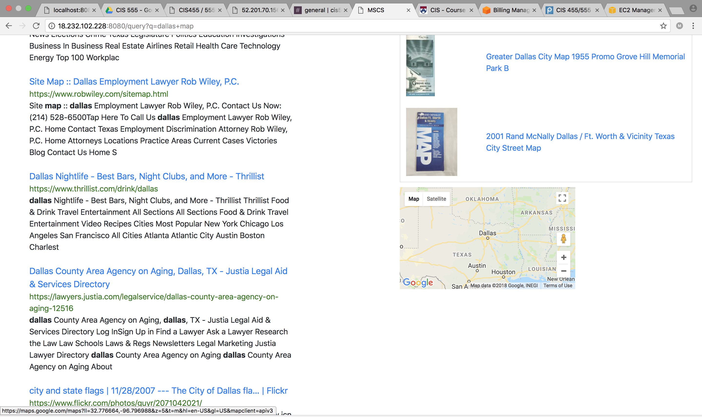

# SearchEngine
A distributed search engine with scalable crawler and indexer.  
Detailed report can be found [here](https://drive.google.com/file/d/1okhyIMINsN540Qcb1n7rk984ggG6v6BJ/view?usp=sharing)  
 
It was able to return relevant results by taking the entire term into consideration rather than just searching keywords independently.  

 
 
Again, instead of searching 'Penn' and 'President' independently, it considered them as the same phrase.

 
 

 
 
 
It can also show current weather, map, items from ebay, etc. based on the search query. 

 
 

 

